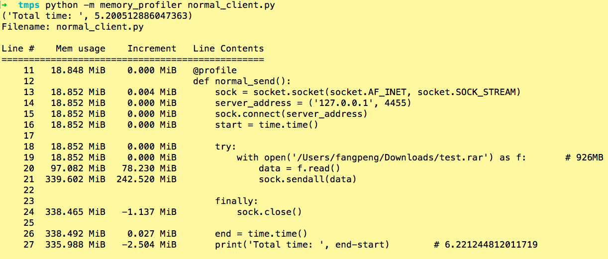

# What Is Zero-Copy?

Like:

	read(file, tmp_buf, len);
	write(socket, tmp_buf, len);

The process:

Zero Copy:

	sendfile(socket, file, len)

The process:

# Test for Python

Statistics for normal_client.py

Statistics for zero_copy_client.py

Statistics for iter_client.py

	1024*2,         # 2KB           # ('Total time: ', 6.821664810180664)
    1024*20,        # 2MB,          # ('Total time: ', 3.6460180282592773)
    1024*200,       # 20MB,         # ('Total time: ', 2.9026339054107666)
    1024*2000,      # 200MB,        # ('Total time: ', 2.0263049602508545)
    1024*3000,      # 300MB,        # ('Total time: ', 2.5401439666748047)
    1024*4000,      # 400MB,        # ('Total time: ', 2.111877202987671)
    1024*5000,      # 500MB,        # ('Total time: ', 2.186924934387207)
    1024*6000,      # 600MB,        # ('Total time: ', 2.3770549297332764)
    1024*7000,      # 600MB,        # ('Total time: ', 2.230679988861084)
    1024*8000,      # 600MB,        # ('Total time: ', 2.6439990997314453)
    1024*9000,      # 600MB,        # ('Total time: ', 2.1612918376922607)
    1024*10000,     # 1GB,          # ('Total time: ', 2.2416698932647705)

